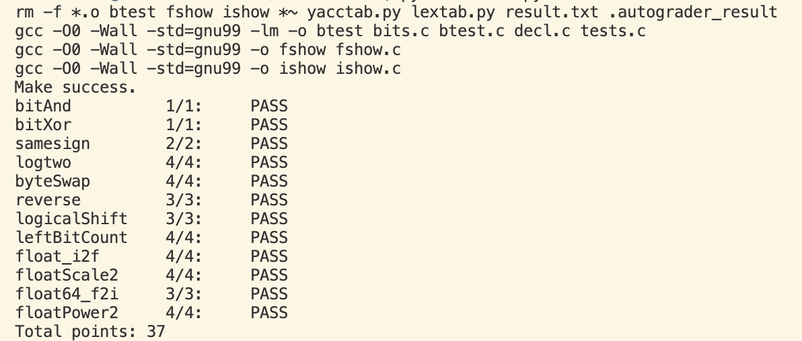

# datalab 报告

姓名：张三

学号：2000000000

| 总分 | bitAnd | bitXor | samesign | logtwo | byteSwap | reverse | logicalShift | leftBitCount | float_i2f | floatScale2 | float64_f2i | floatPower2 |
| --- | --- | --- | --- | --- | --- | --- | --- | --- | --- | --- | --- | --- |
| 37/37 | 1/1 | 1/1 | 2/2 | 4/4 | 4/4 | 3/3 | 3/3 | 4/4 | 4/4 | 4/4 | 3/3 | 4/4 |


test 截图：



## 解题报告

### 亮点

<!-- 告诉助教哪些函数是你实现得最优秀的，比如你可以排序。不需要展开，展开请放到后文中。 -->

1. samesign
2. logtwo
3. leftBitCount

### samesign

```c
int samesign(int x, int y) {
    if(!x && !y)return 1;   //0，0
    if(!x ^ !y)return 0;    //有一个是0
    return !(x>>31 ^ y>>31);//符号位异或比较
}
```

如代码，因为0既不是正数也不是负数，因此首先处理两个0，然后处理一个0一个1。最后直接用符号为判断即可。

### logtwo

```c
int logtwo(int v) {
    int r=0;
    int temp;

    temp = ((v>>16)>0) <<4;//v的16位往上有1吗？有则temp=16；
    v >>= temp;
    r |= temp;

    temp = ((v>>8)>0) <<3;//v的24位/8位往上有1吗？有则temp=8；
    v >>= temp;
    r |= temp;

    temp = ((v>>4)>0) <<2;//+4? 4:0
    v >>= temp;
    r |= temp;

    temp = ((v>>2)>0) <<1;//+2？
    v >>= temp;
    r |= temp;

    temp = ((v>>1)>0);//+1？
    v>>= temp;
    r|=temp;

    return r;
    
}
```

由于存储只有31个有效位，我们可以简易的使用1、2、4、8、16来组合成最高的1的位置。
由于这里每步都类似，这里就以16为例。
右移16位后，如果仍大于0，则表示高16位存在1。此时temp被赋值为16，累加至r。
v也因此左移16位，准备检测高8位是否存在1。
如果不大于0，则1在低16位，v不动，准备检测第8-15位。

## 反馈/收获/感悟/总结

<!-- 这一节，你可以简单描述你在这个 lab 上花费的时间/你认为的难度/你认为不合理的地方/你认为有趣的地方 -->

<!-- 或者是收获/感悟/总结 -->

<!-- 200 字以内，可以不写 -->

难度主要在于设计算法以获得想要的结果。PPT中的基础算法需要恰当的组合和变化以适应符号限制。另外，一开始我不能适应位运算的逻辑，因此有时候不能想出需要的算法。
此外浮点数需要注意格式。
我现在基本上掌握了几种基本的位运算操作和算法，并记住了浮点数的存储格式。

## 参考的重要资料

<!-- 有哪些文章/论文/PPT/课本对你的实现有重要启发或者帮助，或者是你直接引用了某个方法 -->

<!-- 请附上文章标题和可访问的网页路径 -->
2_编码上_GreatIdea引入与01到万物.pptx 提供基础位运算算法
3_编码下_有符号补码与浮点.pptx 提供float的存储格式
 
